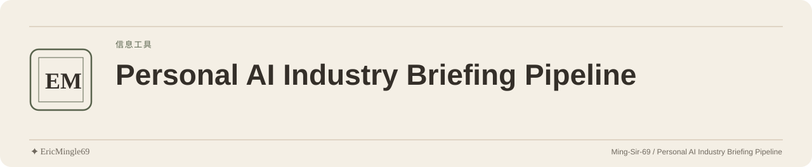

<picture>
  <source media="(prefers-color-scheme: dark)" srcset="readme-assets/header-dark.svg">
  <source media="(prefers-color-scheme: light)" srcset="readme-assets/header-light.svg">
  
</picture>

<p align="center">
  <a href="README.md">简体中文</a> · <a href="README.en.md">English</a> · <a href="PERSONAL-NOTICE.md">✦ EricMingle69</a>
</p>

# 个人 AI 行业情报管线

## 项目定位

将公开 AI 行业信息整理为可追溯候选事件，并提供普通 HTML 审核页面；候选整理与最终审稿分开。

## 阅读入口

| 入口 | 内容 |
| --- | --- |
| [公开首页](https://ming-sir-69.github.io/personal-intelligence-briefing/) | 只读展示入口，是否可用以当前部署为准 |
| [当前状态](https://ming-sir-69.github.io/personal-intelligence-briefing/current/status/) | 检查当前批次与新鲜度 |
| [晨间审核页](https://ming-sir-69.github.io/personal-intelligence-briefing/current/morning/) | 晨间候选信息 |
| [午间审核页](https://ming-sir-69.github.io/personal-intelligence-briefing/current/noon/) | 午间候选信息 |
| [核心源码](src/intelligence_briefing/) | 候选处理与页面相关实现 |
| [页面生成入口](scripts/build_public_pages.py) | 派生公开只读展示层 |
| [项目依赖](pyproject.toml) | 版本与 Python 要求 |

## 从哪里开始

1. 先查看当前状态，再进入相应审核页。
2. 以正文的 `batch_id`、`generated_at`、`source_commit_sha` 判断新鲜度。
3. 本地生成页面需 Python ≥3.12，在同一虚拟环境安装项目后执行：

```sh
python -m pip install -e .
python scripts/build_public_pages.py --root "$PWD"
```

## 使用边界

- `delivery/current/*.json` 是正式状态源，`docs/current/` 是确定性派生的只读展示层。
- 失败或部分成功批次不会替换上一份成功页面；不能用旧内容填充失败批次。
- 仅处理公开信息；模型密钥从 Actions Secrets 读取，Pages 部署 job 不接收模型密钥。
- 页面可用性与信息时效需看实际批次和部署状态，不能据展示存在推断实时。

## 来源与原有许可

原仓库没有 LICENSE/NOTICE，代码与既有资料的复用许可未明确。公开来源应保留可追溯链接，内部、客户或个人资料不属于本项目输入范围。

---

文档维护：**✦ EricMingle69** · [Ming-Sir-69](https://github.com/Ming-Sir-69)  
[个人标识、许可与权限说明](PERSONAL-NOTICE.md) · 明暗页眉随 GitHub 主题自动切换。
